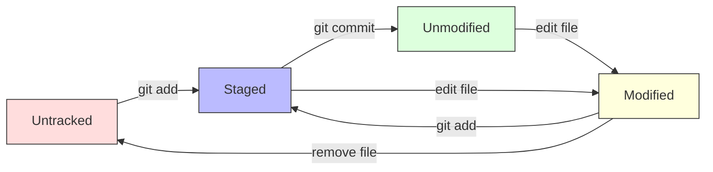

# 3.1 Git Fundamentals and Workflow

## 핵심 개념

Git은 스냅샷 기반의 분산 버전 관리 시스템으로, 프로젝트의 전체 이력을 로컬에 저장하여 네트워크 연결 없이도 대부분의 작업을 수행할 수 있습니다. 생물정보학 연구에서는 분석 스크립트, 설정 파일, 결과 데이터의 변경 추적과 협업에 필수적입니다.

### Git의 3-영역 모델

Git은 작업 디렉토리(Working Directory), 스테이징 영역(Staging Area), 저장소(Repository)의 3단계 구조로 파일 변경을 관리합니다.


각 영역의 역할과 특징:

- **작업 디렉토리 (Working Directory)**: 실제 파일들이 위치하는 공간으로, 파일을 편집하고 수정하는 곳입니다.
- **스테이징 영역 (Staging Area/Index)**: 다음 커밋에 포함될 변경사항들을 임시로 저장하는 공간입니다.
- **로컬 저장소 (Local Repository)**: 프로젝트의 모든 이력이 저장되는 `.git` 디렉토리입니다.
- **원격 저장소 (Remote Repository)**: GitHub, GitLab 등의 서버에 있는 공유 저장소입니다.

```bash
# 파일 상태 확인
$ git status
On branch main
Changes to be committed:
  (use "git restore --staged <file>..." to unstage)
        modified:   analysis.py

Changes not staged for commit:
  (use "git add <file>..." to update what will be committed)
  (use "git restore <file>..." to discard changes in working directory)
        modified:   config.yaml

Untracked files:
  (use "git add <file>..." to include in what will be committed)
        results/new_data.csv
```

### Git 오브젝트 모델

Git은 내부적으로 4가지 타입의 오브젝트를 사용하여 데이터를 저장합니다. 이 구조를 이해하면 Git의 동작 원리를 명확히 파악할 수 있습니다.

```bash
# Git 오브젝트 타입들
- Blob: 파일 내용 저장
- Tree: 디렉토리 구조와 파일명 저장
- Commit: 스냅샷과 메타데이터 저장
- Tag: 특정 커밋에 대한 참조

# 커밋 오브젝트 구조 확인
$ git cat-file -p HEAD
tree 4b825dc642cb6eb9a060e54bf8d69288fbee4904
parent a1b2c3d4e5f6789012345678901234567890abcd
author Researcher <researcher@university.edu> 1640995200 +0900
committer Researcher <researcher@university.edu> 1640995200 +0900

Add RNA-seq analysis pipeline

This commit includes:
- Quality control scripts
- Read alignment pipeline
- Differential expression analysis
```

해시 기반 무결성:

```bash
# 모든 오브젝트는 SHA-1 해시로 식별
$ git log --oneline -3
a1b2c3d (HEAD -> main) Add RNA-seq analysis pipeline
e4f5g6h Update quality control parameters
i7j8k9l Initial project setup

# 해시는 내용의 변경을 즉시 감지
$ echo "Modified content" >> analysis.py
$ git add analysis.py
$ git commit -m "Update analysis"
b2c3d4e (HEAD -> main) Update analysis  # 새로운 해시 생성
```

### 기본 설정과 초기화

Git 사용 전 기본 설정을 통해 커밋 작성자 정보와 편집기를 지정해야 합니다.

```bash
# 사용자 정보 설정 (필수)
git config --global user.name "Researcher Name"
git config --global user.email "researcher@university.edu"

# 편집기 설정
git config --global core.editor "vim"
git config --global core.editor "code --wait"  # VS Code 사용시

# 기본 브랜치 이름 설정
git config --global init.defaultBranch main

# 줄바꿈 처리 (OS별 다름)
git config --global core.autocrlf input    # Linux/macOS
git config --global core.autocrlf true     # Windows

# 설정 확인
git config --list | grep user
git config --global --list
```

고급 설정:

```bash
# 별칭 설정으로 생산성 향상
git config --global alias.st status
git config --global alias.co checkout
git config --global alias.br branch
git config --global alias.ci commit
git config --global alias.unstage 'reset HEAD --'
git config --global alias.last 'log -1 HEAD'
git config --global alias.visual '!gitk'

# 색상 설정
git config --global color.ui auto
git config --global color.branch auto
git config --global color.diff auto
git config --global color.status auto

# diff 도구 설정
git config --global diff.tool vimdiff
git config --global merge.tool vimdiff
```

### 파일 상태와 라이프사이클

Git에서 파일은 추적됨(Tracked)과 추적되지 않음(Untracked) 상태로 구분되며, 추적되는 파일은 다시 수정되지 않음(Unmodified), 수정됨(Modified), 스테이징됨(Staged) 상태를 가집니다.



상태별 명령어:

```bash
# 파일 상태 확인
git status                          # 전체 상태 요약
git status --short                  # 간단한 형태
git status --porcelain             # 스크립트용 형태

# 파일별 상태 기호 의미
# ?? : Untracked
# A  : Added (새 파일이 스테이징됨)
# M  : Modified (기존 파일이 수정됨)
# D  : Deleted (파일이 삭제됨)
# R  : Renamed (파일명이 변경됨)
# C  : Copied (파일이 복사됨)

# 변경 내용 확인
git diff                           # 작업 디렉토리 vs 스테이징 영역
git diff --staged                  # 스테이징 영역 vs 최신 커밋
git diff HEAD                      # 작업 디렉토리 vs 최신 커밋
git diff --name-only              # 변경된 파일명만 표시
```

### 커밋 메시지 작성 규칙

생물정보학 연구에서는 분석 과정과 변경 이유를 명확히 기록하는 것이 중요합니다. 일관성 있는 커밋 메시지 규칙을 따르면 프로젝트 이력을 효과적으로 관리할 수 있습니다.

```bash
# 좋은 커밋 메시지 구조
<type>(<scope>): <subject>

<body>

<footer>

# 예시:
feat(pipeline): Add quality control step for RNA-seq data

- Implement FastQC integration for read quality assessment
- Add trimming step using Trimmomatic
- Update pipeline configuration for batch processing

Closes #123
```

커밋 타입 분류:

```bash
# 주요 커밋 타입들
feat:     새로운 기능 추가
fix:      버그 수정
docs:     문서 변경
style:    코드 스타일 변경 (포매팅, 세미콜론 등)
refactor: 코드 리팩토링 (기능 변경 없음)
test:     테스트 추가 또는 수정
chore:    빌드 과정 또는 보조 도구 변경
perf:     성능 개선
data:     데이터 파일 추가 또는 변경 (생물정보학 특화)
config:   설정 파일 변경
analysis: 분석 방법 또는 매개변수 변경

# 실제 사용 예시
git commit -m "feat(alignment): Add BWA-MEM alignment pipeline"
git commit -m "fix(qc): Correct quality score calculation in FastQC parser"
git commit -m "data(samples): Add control group RNA-seq data (n=12)"
git commit -m "config(cluster): Update SLURM job parameters for large datasets"
git commit -m "analysis(deseq): Adjust p-value threshold to 0.01"
```

### 이력 조회와 탐색

프로젝트의 변경 이력을 효과적으로 탐색하는 것은 연구 과정 추적과 문제 해결에 필수적입니다.

```bash
# 기본 로그 조회
git log                            # 전체 커밋 이력
git log --oneline                  # 한 줄씩 간단히 표시
git log --graph                    # 브랜치 그래프와 함께
git log --all                      # 모든 브랜치 포함

# 특정 조건으로 필터링
git log --since="2 weeks ago"      # 2주 이내 커밋
git log --until="2023-12-31"       # 특정 날짜 이전
git log --author="Researcher"      # 특정 작성자
git log --grep="RNA-seq"           # 메시지에 키워드 포함
git log -S "function_name"         # 코드에서 특정 문자열 변경

# 파일별 이력
git log --follow path/to/file      # 파일명 변경 추적
git log -p path/to/file           # 파일 변경 내용과 함께
git log --stat                     # 변경 파일 통계와 함께

# 고급 포맷팅
git log --pretty=format:"%h %an %ar %s"
git log --pretty=format:"%C(yellow)%h%C(reset) %C(blue)%an%C(reset) %C(green)%ar%C(reset) %s"
```

특정 변경사항 추적:

```bash
# 특정 함수나 코드 블록의 변경 이력
git log -L :function_name:script.py         # 함수별 변경 이력
git log -L 10,20:config.yaml               # 특정 라인 범위 변경 이력

# 파일 이동 및 복사 추적
git log --follow --find-renames=40% file.py    # 40% 이상 유사하면 이름 변경으로 간주
git log --find-copies-harder                   # 복사된 파일도 추적

# blame을 통한 라인별 작성자 확인
git blame analysis.py                          # 각 라인의 마지막 수정자
git blame -L 10,20 analysis.py               # 특정 라인 범위만
git blame -w analysis.py                      # 공백 변경 무시
```

## Practice Section: Git 기초 실습

### 실습 1: Git 초기 설정

```bash
# Git 설정 확인 및 구성
git config --global user.name "Bio Researcher"
git config --global user.email "researcher@biolab.edu"

# 별칭 설정
git config --global alias.st "status --short"
git config --global alias.lg "log --oneline --graph"

# 설정 확인
git config --list | grep user
```

### 실습 2: 저장소 초기화와 첫 커밋

```bash
cd ~/bioproject

# Git 저장소 초기화
git init
git status

# README 파일 생성
echo "# Bioinformatics Analysis Project" > README.md
git add README.md
git commit -m "feat: Initial project setup with README"
```

### 실습 3: 파일 상태 추적

```bash
# 새 파일 생성
echo "import pandas as pd" > analysis.py
echo "samples = 24" > config.py

# 상태 확인
git status
git status --short

# 파일 스테이징과 커밋
git add analysis.py
git status
git commit -m "feat(analysis): Add basic analysis script"
```

### 실습 4: 변경사항 확인

```bash
# 파일 수정
echo "import numpy as np" >> analysis.py
echo "samples = 48" > config.py

# 변경사항 확인
git diff
git diff --name-only

# 부분적 스테이징
git add analysis.py
git status
git diff --staged
```

### 실습 5: 커밋 이력 확인

```bash
# 이력 조회
git log
git log --oneline
git log --stat

# 특정 파일 이력
git log analysis.py
git log --follow analysis.py
```

## 핵심 정리

### Git 기본 워크플로우

```bash
# 표준 작업 순서
git status          # 현재 상태 확인
git add <files>     # 변경사항 스테이징
git commit -m "msg" # 커밋 생성
git log            # 이력 확인
```

### 필수 명령어

```bash
# 설정
git config --global user.name "Name"
git config --global user.email "email"

# 기본 작업
git init           # 저장소 초기화
git add <file>     # 파일 스테이징
git commit -m      # 커밋 생성
git status         # 상태 확인
git log           # 이력 조회
git diff          # 변경사항 확인
```

**다음**: [3.2 Repository Management](./ch03-2-repository-management.md)
