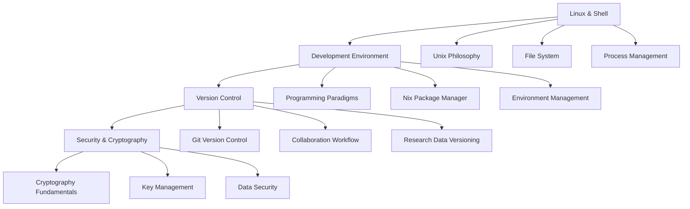

# Part I: Foundation

현대적인 연구 환경 구축에 필요한 핵심 기술들을 학습합니다.

## 🎯 Part I 학습 목표

**재현 가능성(Reproducibility)** 과 **효율적인 협업(Collaboration)** 을 통해 모든 연구자가 동일하고 안전한 환경에서 작업할 수 있도록 합니다.

## 📚 Chapter 구성

### Chapter 1: Linux & Shell Fundamentals

**"모든 것의 기초가 되는 명령줄 환경"**

연구 환경의 기반이 되는 Linux/Unix 시스템과 Shell 환경을 마스터합니다. 생물정보학과 데이터 분석에서 필수적인 명령줄 도구들을 학습합니다.

**핵심 도구**: `bash`, `grep`, `awk`, `sed`, `find`, `xargs`

### Chapter 2: Development Environment

**"재현 가능한 연구 환경 구축"**

함수형 패키지 관리자 Nix를 통해 완전히 재현 가능한 개발 환경을 구축합니다. 의존성 충돌 없이 다양한 도구를 격리된 환경에서 사용하는 방법을 학습합니다.

**핵심 도구**: `nix`, `nix-shell`, `flakes`, `direnv`

### Chapter 3: Version Control & Collaboration

**"연구 코드와 데이터의 체계적 관리"**

Git을 활용한 버전 관리와 GitHub을 통한 협업 워크플로우를 학습합니다. 연구 데이터의 버전 관리와 재현 가능한 분석 파이프라인 구축 방법을 다룹니다.

**핵심 도구**: `git`, `github`, `git-lfs`, `dvc`

### Chapter 4: Security & Cryptography

**"연구 데이터와 시스템 보안"**

연구 환경에서 필요한 기본적인 보안 개념과 암호화 도구를 학습합니다. SSH 키 관리, 데이터 암호화, 비밀 정보 관리 방법을 다룹니다.

**핵심 도구**: `ssh`, `gpg`, `age`, `sops`

---

**시작하기**: [Chapter 1: Linux & Shell Fundamentals](./ch01-linux/ch01-0-linux-fundamentals.md)에서 첫 번째 단계를 시작하세요
